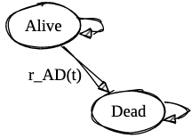

```{r setup, include=FALSE}
# ("rstudio", default", "cerulean", "journal", "flatly", "readable",
# "spacelab", "united", "cosmo", "lumen", "paper", "sandstone", "simplex", or
# "yeti").

    # ace_theme: github
    # theme: united
library(learnr)
library(tidyverse)
library(demography)
library(MortalityLaws)
library(directlabels)
library(ggsci)
library(hrbrthemes)
library(MASS)
library(mgcv)
library(patchwork)
library(knitr)
library(kableExtra)
library(here)
library(ggsci)
library(expm)
select <- dplyr::select
options("scipen" = 100, "digits" = 5)

knitr::opts_chunk$set(echo = FALSE)
options("scipen" = 100, "digits" = 5)
#knitr::opts_knit$set(root.dir = rprojroot::find_rstudio_root_file())
#set_here(here::here("_learnr/smdm-europe-2023-cvd-model/"))
```

# Learning Objectives

In this case study, we will explore discrete time Markov model construction based on mortality rates drawn and constructed from life table data. The specific learning objectives are as follows:

1. Use the `demography` and `MortalityLaws` packages to extract demographic data, construct a life table, and fit a parameteric mortality model. 

2. Construct a simple **Alive-Dead** model to verify that we can recapitulate life expectancy using a discrete time Markov model.

3. Construct a cause-deleted life table for cardiovascular disease (CVD) and use cause-deleted and cause-specific mortality estimates to construct a basic CVD model that matches population-level non-CVD and CVD deaths. 

## 1. Extract, Construct, and Model Life Table Data

```{r, eval = FALSE}
hmd.usa <- 
  demography::hmd.mx("USA",username = "", password = "", "USA")
write_rds(hmd.usa,file=here("_learnr/smdm-europe-2023-cvd-model/www/usa-life-table.rds"))
```

### Extract 
Our first objective is to download and load the Human Mortality Database life table data. We can do so easily using the `hmd.mx` command in the `demography` package. 

```{r}
#| eval: false
#| echo: true
hmd_usa <- 
  demography::hmd.mx("USA",
                     username = "<<your user name>>", 
                     password = "<<your password>>", "USA")
```

> Time permitting, you might try registering your email on the Human Mortality Database and trying this command in a separate R session. 

### Construct the Life Table

We can use the `demography::lifetable()` function to extract the life table data for a single year (2019) and for a population radix (i.e., cohort size) of 100,000 individuals.

```{r}
#| eval: false
#| echo: true

mortality_year = 2019
radix = 100000

lt = 
  hmd_usa %>% 
  demography::lifetable(.,series = "total", years = mortality_year) %>% 
  as_tibble() %>% 
  mutate_at(vars(lx,dx), function(x) x * radix) %>% 
  mutate(country = "USA") %>% 
  mutate(age = x)

```

### Examine the Life Table

Let's take a look at our life table data:

```{r}
mortality_year = 2019
radix = 100000

lt_usa_file <- "https://github.com/graveja0/SMDM-Europe-2023/raw/main/_learnr/smdm-europe-2023-cvd-model/www/usa-life-table.rds"

lt <- 
  readRDS(url(lt_usa_file)) %>% 
  demography::lifetable(.,series = "total", years = mortality_year) %>% 
  as_tibble() %>% 
  mutate_at(vars(lx,dx), function(x) x * radix) %>% 
  mutate(country = "USA") %>% 
  mutate(age = x)
```

```{r}
lt %>%
  ungroup() %>%
  select(-x) %>%
  select(country,age,everything()) %>%
  head() %>%
  kable() %>%
  kable_styling()
```

The columns here are

-   `age`: Ages for lifetable
-   `year`: Period years or cohort years
-   `mx`: Death rate at age x.
-   `qx`: The probability that an individual of exact age x will die before exact age x+1.
-   `lx`: Number of survivors to exact age x. This is defined relative to a **radix**, or the size of a cohort from which the life table is derived).
-   `dx`: The number of deaths between exact ages x and x+1.
-   `Lx`: Number of years lived between exact age x and exact age x+1.
-   `Tx`: Number of years lived after exact age x.
-   `ex`: Remaining life expectancy at exact age x.

> The final column (`ex`) is what we will try to replicate using a discrete time Markov model. 


### Parametric Mortality Modeling

Our next step is to fit a mortality model to these data. Generally speaking, we need three inputs:

-   `age`: Ages for lifetable
-   `dx`: The number of deaths between exact ages x and x+1.
-   `lx`: Number of survivors to exact age x. This is defined relative to a **radix**, or the size of a cohort from which the life table is derived).

The `MortalityLaws` package has a *number* of mortality models we can draw from:

```{r}
#| tbl-cap: Mortality Models in MortalityLaws package

type_lut <- c(
"1"  =  "Infant mortality" ,             
"2"  =  "Accident hump"      ,           
"3"  =  "Adult mortality"   ,           
"4"  =  "Adult and/or old-age mortality",
"5"  =  "Old-age mortality"       ,      
"6"  =  "Full age range" 
)
 
laws <- 
  availableLaws()$table %>% 
  as_tibble() %>% 
  arrange(TYPE) %>% 
  mutate(TYPE = type_lut[paste0(TYPE)]) %>% 
  #filter(CODE=="HP2") %>% 
  #mutate(MODEL = gsub("\\^","||",MODEL))
  mutate(MODEL = paste0("$",MODEL,"$")) %>% 
  mutate(MODEL = ifelse(CODE == "weibull","$mu[x] = 1/sigma * (x/M)^{(M/sigma - 1)}$",MODEL)) %>% 
  mutate(MODEL = ifelse(CODE == "invweibull","$mu[x] = 1/sigma * (x/M)^{[-M/sigma - 1]} / [exp((x/M)^{(-M/sigma)}) - 1]$",MODEL)) %>% 
  mutate(MODEL = ifelse(CODE == "perks","$mu[x] = [A + BC^x] / [BC^{-x} + 1 + DC^x]$",MODEL)) %>% 
  mutate(MODEL = ifelse(CODE == "wittstein","$q[x] = (1/B) A^{-[(Bx)^N]} + A^{-[(M-x)^N]}$",MODEL)) %>% 
  mutate(MODEL = ifelse(CODE == "HP","$q[x]/p[x] = A^{[(x + B)^C]} + D exp[-E log(x/F)^2] + G H^x$",MODEL)) %>% 
  mutate(MODEL = ifelse(CODE == "HP2","$q[x] = A^{[(x + B)^C]} + D exp[-E log(x/F)^2] + GH^x / [1 + GH^x]$",MODEL)) %>% 
  mutate(MODEL = ifelse(CODE == "HP3","$q[x] = A^{[(x + B)^C]} + D exp[-E log(x/F)^2] + GH^x / [1 + KGH^x]$",MODEL)) %>% 
  mutate(MODEL = ifelse(CODE == "HP3","$q[x] = A^{[(x + B)^C]} + D exp[-E log(x/F)^2] + GH^x / [1 + KGH^x]$",MODEL)) %>% 
  mutate(MODEL = ifelse(CODE == "kostaki","$q[x]/p[x] = A^{[(x+B)^C]} + D exp[-(E_i log(x/F_))^2] + G H^x$",MODEL))
  

laws %>% 
  select(-YEAR,-TYPE,-FIT,-SCALE_X) %>% 
  kable(col.names = c("Name","Model","Code")) %>% 
  pack_rows(index = table(fct_inorder(laws$TYPE)))
```

### Fitting a Parametric Mortality Model

Our objective in this section is to take the raw life table data and fit a parametric model to it. This is a useful exercice in case you need to reduce mortality to just a few parameters, or if you need to sample a death time for use in a discrete event simulation (DES) model. 


```{r loadlt}
mortality_year = 2019
radix = 100000

lt_usa_file <- "https://github.com/graveja0/SMDM-Europe-2023/raw/main/_learnr/smdm-europe-2023-cvd-model/www/usa-life-table.rds"

lt <- 
  readRDS(url(lt_usa_file)) %>% 
  demography::lifetable(.,series = "total", years = mortality_year) %>% 
  as_tibble() %>% 
  mutate_at(vars(lx,dx), function(x) x * radix) %>% 
  mutate(country = "USA") %>% 
  mutate(age = x)
```


### Exercise 1. 

Use one of the mortality laws to fit a parametric model to the life table data. You can fit this model over any age range (e.g., 0-99, 40-99, etc.). We suggest playing around with different age ranges (e.g., children only, adults only, all ages) and the following mortality models:

- Gompertz (law = `gompertz`)
- Makeham (law = `makeham`)
- Heligman-Pollard (law = `HP`)


```{r parmort, exercise = TRUE, exercise.eval = FALSE, exercise.setup="loadlt"}

min_age = 0
max_age = 99

ages     <- lt$x[lt$x<=max_age & lt$x>=min_age]
deaths   <- lt$dx[lt$x<=max_age & lt$x>=min_age]
exposure <- lt$lx[lt$x<=max_age & lt$x>=min_age]

mort_fit <- MortalityLaw(
                x  = ages,
                Dx  = deaths,   # vector with death counts
                Ex  = exposure, # vector containing exposures
                law = "",
                opt.method = "LF2")
plot(mort_fit)
```

### Exercise 2

After we fit a parametric mortality model, we'll want to calculate a mortality rate or probability of death at some time $x$. Doing so requires plugging in the estimated parameters into the equations shown in the mortality model table above. 

For example, suppose we fit a gompertz model to the underlying life table data. The gompertz model is goverened by two parameters ("A" and "B") and the mortality rate `mx` at  time $=x$ is calculated as

$$
mx = A \exp(Bx)
$$

While we could hand code the necessary formula, the `MortalityLaws` package actually includes functions for each model. That is, for a gompertz model we can just use the function `gompertz()`, which takes as its input the time (`x`) you want to calculate mortality for, and the **coefficients** from the fitted model object; you can extract these using the `coef()` command.

> In the code block below,  fit a model for a starting cohort of 40 year olds using the `HP` mortality law, and predict the mortality rate for a 75 year old.  You can simply use the supplied `HP()` function to do this. HINT: the `x` value input is the age of the individual. So for a 40 year old, x=40, for a 41 year old, x = 41, etc.

```{r cohort40, exercise = TRUE, exercise.eval = FALSE, exercise.setup="loadlt"}
#| exercise.lines: 20
#| 
min_age = 
max_age = 99

ages     <- lt$x[lt$x<=max_age & lt$x>=min_age]
deaths   <- lt$dx[lt$x<=max_age & lt$x>=min_age]
exposure <- lt$lx[lt$x<=max_age & lt$x>=min_age]

mort_fit <- MortalityLaw(
                x  = ages,
                Dx  = deaths,   
                Ex  = exposure, 
                law = "",
                opt.method = "LF2")

r_mort75 <- 
r_mort75
```

```{r cohort40-solution}
min_age = 40
max_age = 99

ages     <- lt$x[lt$x<=max_age & lt$x>=min_age]
deaths   <- lt$dx[lt$x<=max_age & lt$x>=min_age]
exposure <- lt$lx[lt$x<=max_age & lt$x>=min_age]

mort_fit <- MortalityLaw(
                x  = ages,
                Dx  = deaths,   
                Ex  = exposure, 
                law = "HP",
                opt.method = "LF2")

r_mort75 <-  HP(x = 40, coef(mort_fit))
r_mort75
```

How does your modeled mortality rate compare to the rate listed in the original life table?

```{r}
lt %>%
  filter(age ==75) %>% 
  ungroup() %>%
  select(-x) %>%
  select(age,everything()) %>%
  kable() %>%
  kable_styling()
```


## 2. Construct a simple **Alive-Dead** model 

With background mortality fit we can construct a simple alive-dead model that is governed by a single transition rate ($r\_AD(t)$): the transition from alive to dead at time $t$:

```{r setup2}
#| echo: false
#| warning: false
#| messages: false
#| eval: true
mortality_year = 2019
radix = 100000

edit.na <- function(x, value) { x[is.na(x)] <- value; x}

lt_usa_file <- "https://github.com/graveja0/SMDM-Europe-2023/raw/main/_learnr/smdm-europe-2023-cvd-model/www/usa-life-table.rds"

lt <- 
  readRDS(url(lt_usa_file)) %>% 
  demography::lifetable(.,series = "total", years = mortality_year) %>% 
  as_tibble() %>% 
  mutate_at(vars(lx,dx), function(x) x * radix) %>% 
  mutate(country = "USA") %>% 
  mutate(age = x)

min_age = 40
max_age = 99

ages     <- lt$x[lt$x<=max_age & lt$x>=min_age]
deaths   <- lt$dx[lt$x<=max_age & lt$x>=min_age]
exposure <- lt$lx[lt$x<=max_age & lt$x>=min_age]

mort_fit <- MortalityLaw(
                x  = ages,
                Dx  = deaths,   # vector with death counts
                Ex  = exposure, # vector containing exposures
                law = "HP2",
                opt.method = "LF2")

params <- list(initial_age = 40, 
               n_cycles = 70, 
               cycle_length = 1, 
               background_mortality = coef(mort_fit),
               payoff_qaly = c("alive" = 1, "dead" = 0),
               payoff_cost = c("alive" = 0, "dead" = 0))

m_Pt_fn <- function(t, params)
{
    with(params, {
      lapply(t, function(tt){
          current_age = initial_age + cycle_length * tt
          r_death =  HP2(current_age, params$background_mortality)$hx
          p_death = 1 - exp(-r_death * cycle_length)
          
          matrix(c(1-p_death,p_death,0,0), 
                 byrow = TRUE,
                 nrow=2,
                 dimnames = list(c("alive","dead"),c("alive","dead")))
          
      })
    })
}

params$m_P <- m_Pt_fn(0:params$n_cycles, params)


sim_alive_dead <- function(params) {
    tr_ <- t(c("alive" = 1, "dead" = 0))
    tr <- 
        do.call(rbind,lapply(params$m_P, function(tp) {
            tr_ <<- tr_ %*% tp
        }))
    tr <- rbind(t(c(1,0)),tr)
    return(tr)
}

tr_alive_dead <- sim_alive_dead(params)

alt_simp_coef <- function(i) c(17, 59, 43, 49, rep(48, i-8), 49, 43, 59, 17) / 48
cycle_adj      <- function(x,h) h*sum(alt_simp_coef(length(x)) * x)

life_exp <- 
    cycle_adj(tr_alive_dead %*% params$payoff_qaly, 1)

life_exp_life_table <- 
  lt %>% filter(x==min_age) %>% pull(ex)


```

{fig-align="center" height="200px"}

###  Parameterize the Model

Our first step is to define a parameter list object with several components:

-   The initial age of the cohort (40)
-   The total number of cycles
-   The time step for the discrete time Markov (1 = one year)
-   Background mortality parameters (i.e., the coefficients from a fitted mortality model object)
-   Utility payoffs for each health state. HINT: For life expectancy we can just set these to 1.0 for the alive state, and 0 for dead.
-   Cost payoffs for each health state. Irrelevant for this exercise but we'll include for the sake of completeness.

> In the code block below, parametrize a model for a starting cohort of 40 year-olds with an **annual time step**, *70 total cycles**, and background mortality based on the estimated coefficients from a **Heligman-Pollard** model fit to the underlying life table data (i.e., `HP`). You should also include "payoffs" of 1 for alive and 0 otherwise, and \$0 in costs for each health state.

```{r 2a_1, exercise = TRUE, exercise.eval = FALSE, exercise.setup = "setup2"}
#| exercise.lines: 20

mort_fit <- MortalityLaw(
                x  = ages,
                Dx  = deaths,   # vector with death counts
                Ex  = exposure, # vector containing exposures
                law = ,
                opt.method = "LF2")

params <-
  list(
    initial_age = , 
    n_cycles = ,
    cycle_length = ,
    background_mortality = ,
    payoff_qaly = c("alive" = 1, "dead" = 0),
    payoff_cost = c("alive" = 0, "dead" = 0)
  )

```

```{r 2a_1-solution}

mort_fit <- MortalityLaw(
                x  = ages,
                Dx  = deaths,   # vector with death counts
                Ex  = exposure, # vector containing exposures
                law = "HP",
                opt.method = "LF2")

params <-
  list(
    initial_age = 40, 
    n_cycles = 70,
    cycle_length = 1,
    background_mortality = coef(mort_fit),
    payoff_qaly = c("alive" = 1, "dead" = 0),
    payoff_cost = c("alive" = 0, "dead" = 0)
  )

```

We next need to define a function that returns the transition probability matrix for each time cycle in our model.

-   Each transtition probability matrix is a $2 \times 2$ matrix with two health states: alive and dead.
-   Each has a transition probability from alive to dead based on converting the mortality rate at that time step into a probability.
    -   Beacuse there are no other competing events in this exercise, it's fine to use the standard conversion formula (i.e., $1 - \exp(rh)$, where $r$ is the rate and $h$ is the time step).
-   The primary input into the function below is a vector that starts at 1 and runs through the final cycle number (i.e., 1, 2, ... , params\$n_cycles), as well as a time step (h=1 for annual, h = 1/12 for monthly, etc.).

```{r 2a_2, exercise = TRUE, exercise.eval = TRUE, exercise.setup = "setup2"}
#| exercise.lines: 22

m_Pt_fn <- function(t, params)
{
    with(params, {
      lapply(t, function(tt){
          current_age = initial_age + cycle_length * tt
          r_death =  HP2(current_age, params$background_mortality)$hx
          p_death = 1 - exp(-r_death * cycle_length)
          
          matrix(c(1-p_death,p_death,0,0), 
                 byrow = TRUE,
                 nrow=2,
                 dimnames = list(c("alive","dead"),c("alive","dead")))
          
      })
    })
}

params$m_P <- # We start at cycle 0 to include the initial fully alive cohort 
  m_Pt_fn(0:params$n_cycles, params)

# Look at the transition probability matrix for the 70th time step. 
params$m_P[[70]]
```

### Construct a Markov Trace

We will next construct a markov trace by, essentially, looping over the list object with transition probability matrices at each time step (i.e., `m_P`).

The code below draws on the "super assignment" operator `<<-`, which allows for assignment in the global environment outside the function call itself. That is, the code below will continuously update the Markov trace object `tr` until the total number of cycles is reached.

For life expectancy we will simulate a single "cohort" of one indiviudal.

```{r 2b, exercise = TRUE, exercise.setup = "setup2"}
#| exercise.lines: 18

sim_alive_dead <- function(params) {
    tr_ <- t(c("alive" = 1, "dead" = 0))
    tr <- 
        do.call(rbind,lapply(params$m_P, function(tp) {
            tr_ <<- tr_ %*% tp
        }))
    tr <- rbind(t(c(1,0)),tr)
    return(tr)
}

tr_alive_dead <- sim_alive_dead(params)

tr_alive_dead %>% 
  head() %>% 
  kable() %>% 
  kable_styling()

```

### Calculate Life Expectancy

Let's first examine how the mortality Markov model does against observed life table data.

We can first use the Markov trace to construct a "Markov Life Table" , and then plot the age-specific death rate calculated from the Markov model against the age-specific rate directly from the life table data.

We see in this exercise that the two are very similar, suggesting that we are approximately matching the mortality dynamics in the population throughout our model.

```{r 2c1, exercise = TRUE, exercise.eval = TRUE, exercise.setup = "setup2"}
#| exercise.lines: 18
lt_markov <- 
  tr_alive_dead %>% 
  as_tibble() %>%
  mutate(lx = radix * alive) %>%
  mutate(q = edit.na(1 - lead(lx)/lx, 1)) %>%
  mutate(age = min_age + (row_number()-1)/1) %>% 
  inner_join(lt %>% filter(age>=min_age & age <max_age),"age") %>% 
  select(age, q, qx) %>% 
  gather(source,value,-age) %>% 
  mutate(source = factor(source,levels = c("q","qx"), labels = c("Markov","Life Table")))

lt_markov %>% 
  ggplot(aes(x = age, y = log(value), colour = source)) + 
  geom_point() +
  theme_ipsum_pub(base_family = "Arial") + 
  scale_colour_aaas(name="") + 
  theme(legend.position = "top") + 
  labs(x = "Age" , y = "log(Death Rate)")
```

We will next calculate life expectancy for our modeled cohort of 40 year old's and compare that value to the life expectancy for a 40 year old in the life table data.

To calculate life expectancy from the Markov trace we need to do a few things:

1.  Use a payoff of 1 for "alive" and 0 for dead.
2.  We won't use discounting.
3.  Because we're calculating a cumulative outcome, we need to apply a cycle adjustment. We'll use the alternative Simpson's method for this, but we could just as easily apply a half cycle adjustment, or [some other method](https://journals.sagepub.com/doi/10.1177/0272989X15585121).

```{r 2c, exercise = TRUE, exercise.setup = "setup2"}
#| exercise.lines: 15
alt_simp_coef <- function(i) c(17, 59, 43, 49, rep(48, i-8), 49, 43, 59, 17) / 48
cycle_adj      <- function(x,h) h*sum(alt_simp_coef(length(x)) * x)

life_exp_markov <- 
    cycle_adj(tr_alive_dead %*% params$payoff_qaly, 1)

life_exp_life_table <- 
  lt %>% filter(x==min_age) %>% pull(ex)

life_exp_markov
life_exp_life_table
```

As we see above, we have successfully replicated life expectancy for a 40 year old cohort!
