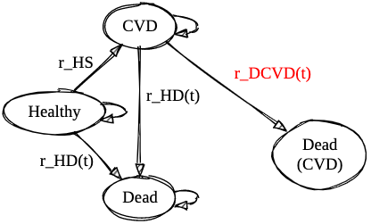

```{r setup, include=FALSE}
# ("rstudio", default", "cerulean", "journal", "flatly", "readable",
# "spacelab", "united", "cosmo", "lumen", "paper", "sandstone", "simplex", or
# "yeti").

    # ace_theme: github
    # theme: united
library(learnr)
library(tidyverse)
library(demography)
library(MortalityLaws)
library(directlabels)
library(ggsci)
library(hrbrthemes)
library(MASS)
library(mgcv)
library(patchwork)
library(knitr)
library(kableExtra)
library(here)
library(ggsci)
library(expm)
select <- dplyr::select
options("scipen" = 100, "digits" = 5)

knitr::opts_chunk$set(echo = FALSE)
options("scipen" = 100, "digits" = 5)
#knitr::opts_knit$set(root.dir = rprojroot::find_rstudio_root_file())
#set_here(here::here("_learnr/smdm-europe-2023-cvd-model/"))
```

## Part 1: Mortality Modeling

In this section we will explore mortality modeling using the `demography` and `MortalityLaws` packages, and using data from the Human Mortality Database

```{r, eval = FALSE}
hmd.usa <- demography::hmd.mx("USA",username = "", password = "", "USA")
write_rds(hmd.usa,file=here("_learnr/smdm-europe-2023-cvd-model/www/usa-life-table.rds"))
```

Our first objective is to download and load the Human Mortality Database life table data.

```{r}
#| eval: false
#| echo: true
hmd_usa <- demography::hmd.mx("USA",username = "<<your user name>>", password = "<<your password>>", "USA")
```

We next use the `demography::lifetable()` to extract the life table data for a single year (2019) and for a population radix (i.e., starting population) of 100,000 indiviudals.

```{r}
#| eval: false
#| echo: true

mortality_year = 2019
radix = 100000

lt = 
  hmd_usa %>% 
  demography::lifetable(.,series = "total", years = mortality_year) %>% 
  as_tibble() %>% 
  mutate_at(vars(lx,dx), function(x) x * radix) %>% 
  mutate(country = "USA") %>% 
  mutate(age = x)

```

Let's take a look at our life table data:

```{r}
mortality_year = 2019
radix = 100000

lt_usa_file <- "https://github.com/graveja0/SMDM-Europe-2023/raw/main/_learnr/smdm-europe-2023-cvd-model/www/usa-life-table.rds"

lt <- 
  readRDS(url(lt_usa_file)) %>% 
  demography::lifetable(.,series = "total", years = mortality_year) %>% 
  as_tibble() %>% 
  mutate_at(vars(lx,dx), function(x) x * radix) %>% 
  mutate(country = "USA") %>% 
  mutate(age = x)
```

```{r}
lt %>%
  ungroup() %>%
  select(-x) %>%
  select(country,age,everything()) %>%
  head() %>%
  kable() %>%
  kable_styling()
```

The columns here are

-   `age`: Ages for lifetable
-   `year`: Period years or cohort years
-   `mx`: Death rate at age x.
-   `qx`: The probability that an individual of exact age x will die before exact age x+1.
-   `lx`: Number of survivors to exact age x. This is defined relative to a **radix**, or the size of a cohort from which the life table is derived).
-   `dx`: The number of deaths between exact ages x and x+1.
-   `Lx`: Number of years lived between exact age x and exact age x+1.
-   `Tx`: Number of years lived after exact age x.
-   `ex`: Remaining life expectancy at exact age x.

### Parametric Mortality Models

Our next step is to fit a mortality model to these data. Generally speaking, we need three inputs:

-   `age`: Ages for lifetable
-   `dx`: The number of deaths between exact ages x and x+1.
-   `lx`: Number of survivors to exact age x. This is defined relative to a **radix**, or the size of a cohort from which the life table is derived).

The `MortalityLaws` package has a *number* of mortality models we can draw from:

```{r}
#| tbl-cap: Mortality Models in MortalityLaws package

type_lut <- c(
"1"  =  "Infant mortality" ,             
"2"  =  "Accident hump"      ,           
"3"  =  "Adult mortality"   ,           
"4"  =  "Adult and/or old-age mortality",
"5"  =  "Old-age mortality"       ,      
"6"  =  "Full age range" 
)
 
laws <- 
  availableLaws()$table %>% 
  as_tibble() %>% 
  arrange(TYPE) %>% 
  mutate(TYPE = type_lut[paste0(TYPE)]) %>% 
  #filter(CODE=="HP2") %>% 
  #mutate(MODEL = gsub("\\^","||",MODEL))
  mutate(MODEL = paste0("$",MODEL,"$")) %>% 
  mutate(MODEL = ifelse(CODE == "weibull","$mu[x] = 1/sigma * (x/M)^{(M/sigma - 1)}$",MODEL)) %>% 
  mutate(MODEL = ifelse(CODE == "invweibull","$mu[x] = 1/sigma * (x/M)^{[-M/sigma - 1]} / [exp((x/M)^{(-M/sigma)}) - 1]$",MODEL)) %>% 
  mutate(MODEL = ifelse(CODE == "perks","$mu[x] = [A + BC^x] / [BC^{-x} + 1 + DC^x]$",MODEL)) %>% 
  mutate(MODEL = ifelse(CODE == "wittstein","$q[x] = (1/B) A^{-[(Bx)^N]} + A^{-[(M-x)^N]}$",MODEL)) %>% 
  mutate(MODEL = ifelse(CODE == "HP","$q[x]/p[x] = A^{[(x + B)^C]} + D exp[-E log(x/F)^2] + G H^x$",MODEL)) %>% 
  mutate(MODEL = ifelse(CODE == "HP2","$q[x] = A^{[(x + B)^C]} + D exp[-E log(x/F)^2] + GH^x / [1 + GH^x]$",MODEL)) %>% 
  mutate(MODEL = ifelse(CODE == "HP3","$q[x] = A^{[(x + B)^C]} + D exp[-E log(x/F)^2] + GH^x / [1 + KGH^x]$",MODEL)) %>% 
  mutate(MODEL = ifelse(CODE == "HP3","$q[x] = A^{[(x + B)^C]} + D exp[-E log(x/F)^2] + GH^x / [1 + KGH^x]$",MODEL)) %>% 
  mutate(MODEL = ifelse(CODE == "kostaki","$q[x]/p[x] = A^{[(x+B)^C]} + D exp[-(E_i log(x/F_))^2] + G H^x$",MODEL))
  

laws %>% 
  select(-YEAR,-TYPE,-FIT,-SCALE_X) %>% 
  kable(col.names = c("Name","Model","Code")) %>% 
  pack_rows(index = table(fct_inorder(laws$TYPE)))
```

### Fitting a Parametric Mortality Model, Part 1

```{r loadlt}
mortality_year = 2019
radix = 100000

lt_usa_file <- "https://github.com/graveja0/SMDM-Europe-2023/raw/main/_learnr/smdm-europe-2023-cvd-model/www/usa-life-table.rds"

lt <- 
  readRDS(url(lt_usa_file)) %>% 
  demography::lifetable(.,series = "total", years = mortality_year) %>% 
  as_tibble() %>% 
  mutate_at(vars(lx,dx), function(x) x * radix) %>% 
  mutate(country = "USA") %>% 
  mutate(age = x)
```

Use one of the mortality laws to fit a parametric model to the life table data. You can fit this model over any age range (e.g., 0-99, 40-99, etc.).

```{r parmort, exercise = TRUE, exercise.eval = FALSE, exercise.setup="loadlt"}

min_age = 0
max_age = 99

ages     <- lt$x[lt$x<=max_age & lt$x>=min_age]
deaths   <- lt$dx[lt$x<=max_age & lt$x>=min_age]
exposure <- lt$lx[lt$x<=max_age & lt$x>=min_age]

mort_fit <- MortalityLaw(
                x  = ages,
                Dx  = deaths,   # vector with death counts
                Ex  = exposure, # vector containing exposures
                law = "",
                opt.method = "LF2")
plot(mort_fit)
```

### Fitting a Parametric Mortality Model, Part 2

Each mortality law has its own function to predict the mortality rate at a given time. In the block below, fit a model for a starting cohort of 40 year olds using the `HP2` mortality law, and predict the mortality rate for a 75 year old.

The basic input into the mortality law function is `x`, or the time period, and the coefficients from the fitted model object.

```{r cohort40, exercise = TRUE, exercise.eval = FALSE, exercise.setup="loadlt"}
#| exercise.lines: 20
#| 
min_age = 
max_age = 99

ages     <- lt$x[lt$x<=max_age & lt$x>=min_age]
deaths   <- lt$dx[lt$x<=max_age & lt$x>=min_age]
exposure <- lt$lx[lt$x<=max_age & lt$x>=min_age]

mort_fit <- MortalityLaw(
                x  = ages,
                Dx  = deaths,   # vector with death counts
                Ex  = exposure, # vector containing exposures
                law = "",
                opt.method = "LF2")

r_mort75 <- 
```

```{r cohort40-solution}
min_age = 40
max_age = 99

ages     <- lt$x[lt$x<=max_age & lt$x>=min_age]
deaths   <- lt$dx[lt$x<=max_age & lt$x>=min_age]
exposure <- lt$lx[lt$x<=max_age & lt$x>=min_age]

mort_fit <- MortalityLaw(
                x  = ages,
                Dx  = deaths,   # vector with death counts
                Ex  = exposure, # vector containing exposures
                law = "HP2",
                opt.method = "LF2")


r_mort75 <-  HP2(x = 75 - min_age, coef(mort_fit))
r_mort75
```

## Part 2: Alive-Dead Model

With background mortality fit we can construct a simple alive-dead model that is governed by a single transition rate ($r\_AD(t)$): the transition from alive to dead at time $t$:

```{r setup2}
#| echo: false
#| warning: false
#| messages: false
#| eval: true
mortality_year = 2019
radix = 100000

edit.na <- function(x, value) { x[is.na(x)] <- value; x}

lt_usa_file <- "https://github.com/graveja0/SMDM-Europe-2023/raw/main/_learnr/smdm-europe-2023-cvd-model/www/usa-life-table.rds"

lt <- 
  readRDS(url(lt_usa_file)) %>% 
  demography::lifetable(.,series = "total", years = mortality_year) %>% 
  as_tibble() %>% 
  mutate_at(vars(lx,dx), function(x) x * radix) %>% 
  mutate(country = "USA") %>% 
  mutate(age = x)

min_age = 40
max_age = 99

ages     <- lt$x[lt$x<=max_age & lt$x>=min_age]
deaths   <- lt$dx[lt$x<=max_age & lt$x>=min_age]
exposure <- lt$lx[lt$x<=max_age & lt$x>=min_age]

mort_fit <- MortalityLaw(
                x  = ages,
                Dx  = deaths,   # vector with death counts
                Ex  = exposure, # vector containing exposures
                law = "HP2",
                opt.method = "LF2")

params <- list(n_cycles = 100, 
               time_step = 1, 
               background_mortality = coef(mort_fit),
               payoff_qaly = c("alive" = 1, "dead" = 0),
               payoff_cost = c("alive" = 0, "dead" = 0))


m_Pt_fn <- function(t, h = 1)
{
    lapply(t, function(tt){
        current_age <- min_age  + (tt)*h - 1
        r_death<- HP2(current_age, params$background_mortality)$hx
        p_death <- 1 - exp(-r_death * h)
        
        matrix(c(1-p_death,p_death,0,0), 
               byrow = TRUE,
               nrow=2,
               dimnames = list(c("alive","dead"),c("alive","dead")))
        
    })
}

params$m_P <- m_Pt_fn(1:params$n_cycles, h = params$time_step)


sim_alive_dead <- function(params) {
    tr_ <- t(c("alive" = 1, "dead" = 0))
    tr <- 
        do.call(rbind,lapply(params$m_P, function(tp) {
            tr_ <<- tr_ %*% tp
        }))
    tr <- rbind(t(c(1,0)),tr)
    return(tr)
}

tr_alive_dead <- sim_alive_dead(params)

alt_simp_coef <- function(i) c(17, 59, 43, 49, rep(48, i-8), 49, 43, 59, 17) / 48
cycle_adj      <- function(x,h) h*sum(alt_simp_coef(length(x)) * x)

life_exp <- 
    cycle_adj(tr_alive_dead %*% params$payoff_qaly, 1)

life_exp_life_table <- 
  lt %>% filter(x==min_age) %>% pull(ex)


```

{fig-align="right" height="200px"}

### 2a. Parameterize the Model

Our first step is to define a parameter object with several components:

-   The total number of cycles
-   The time step for the discrete time Markov (1 = one year)
-   Background mortality parameters (i.e., the coefficients from a fitted mortality model object)
-   Utility payoffs for each health state. For life expectancy we can just set these to 1.0 for the alive state, and 0 for dead.
-   Cost payoffs for each health state. Irrelevant for this exercise but we'll include for the sake of completeness.

In the exercise below, parametrize a model with an **annual time step**, **100 total cycles**, and background mortality based on the estimated coefficients from a **Heligman-Pollard** model fit to the underlying life table data (i.e., `HP`). You should also include "payoffs" of 1 for alive and 0 otherwise, and \$0 in costs for each health state.

```{r 2a_1, exercise = TRUE, exercise.eval = FALSE, exercise.setup = "setup2"}
#| exercise.lines: 20

mort_fit <- MortalityLaw(
                x  = ages,
                Dx  = deaths,   # vector with death counts
                Ex  = exposure, # vector containing exposures
                law = "",
                opt.method = "LF2")

params <-
  list(
    n_cycles = ,
    time_step = ,
    background_mortality = ,
    payoff_qaly = c("alive" = , "dead" = ),
    payoff_cost = c("alive" = , "dead" = )
  )
```

```{r 2a_1-solution}

mort_fit <- MortalityLaw(
                x  = ages,
                Dx  = deaths,   # vector with death counts
                Ex  = exposure, # vector containing exposures
                law = "HP",
                opt.method = "LF2")

params <-
  list(
    n_cycles = 100,
    time_step = 1,
    background_mortality = coef(mort_fit),
    payoff_qaly = c("alive" = 1, "dead" = 0),
    payoff_cost = c("alive" = 0, "dead" = 0)
  )

```

We next need to define a function that returns the transition probability matrix for each time cycle in our model.

-   Each transtition probability matrix is a $2 \times 2$ matrix with two health states: alive and dead.
-   Each has a transition probability from alive to dead based on converting the mortality rate at that time step into a probability.
    -   Beacuse there are no other competing events in this exercise, it's fine to use the standard conversion formula (i.e., $1 - \exp(rh)$, where $r$ is the rate and $h$ is the time step).
-   The primary input into the function below is a vector that starts at 1 and runs through the final cycle number (i.e., 1, 2, ... , params\$n_cycles), as well as a time step (h=1 for annual, h = 1/12 for monthly, etc.).

```{r 2a_2, exercise = TRUE, exercise.eval = TRUE, exercise.setup = "setup2"}
#| exercise.lines: 25

m_Pt_fn <- function(t, h = 1)
{
    lapply(t, function(tt){
        current_age <- min_age  + (tt)*h - 1
        r_death<- HP2(current_age, params$background_mortality)$hx
        p_death <- 1 - exp(-r_death * h)
        
        matrix(c(1-p_death,p_death,0,0), 
               byrow = TRUE,
               nrow=2,
               dimnames = list(c("alive","dead"),c("alive","dead")))
        
    })
}

params$m_P <- m_Pt_fn(1:params$n_cycles, h = params$time_step)
# Look at the transition probability matrix for the 100th time step. 
params$m_P[[100]]
```

### 2b. Construct a Markov Trace

We will next construct a markov trace by, essentially, looping over the list object with transition probability matrices at each time step (i.e., `m_P`).

The code below draws on the "super assignment" operator `<<-`, which allows for assignment in the global environment outside the function call itself. That is, the code below will continuously update the Markov trace object `tr` until the total number of cycles is reached.

For life expectancy we will simulate a single "cohort" of one indiviudal.

```{r 2b, exercise = TRUE, exercise.setup = "setup2"}
#| exercise.lines: 15

sim_alive_dead <- function(params) {
    tr_ <- t(c("alive" = 1, "dead" = 0))
    tr <- 
        do.call(rbind,lapply(params$m_P, function(tp) {
            tr_ <<- tr_ %*% tp
        }))
    tr <- rbind(t(c(1,0)),tr)
    return(tr)
}

tr_alive_dead <- sim_alive_dead(params)

tr_alive_dead %>% 
  head() %>% 
  kable() %>% 
  kable_styling()

```

### 2c. Calculate Life Expectancy

Let's first examine how the mortality Markov model does against observed life table data.

We can first use the Markov trace to construct a "Markov Life Table" , and then plot the age-specific death rate calculated from the Markov model against the age-specific rate directly from the life table data.

We see in this exercise that the two are very similar, suggesting that we are approximately matching the mortality dynamics in the population throughout our model.

```{r 2c1, exercise = TRUE, exercise.eval = TRUE, exercise.setup = "setup2"}
lt_markov <- 
  tr_alive_dead %>% 
  as_tibble() %>%
  mutate(lx = radix * alive) %>%
  mutate(q = edit.na(1 - lead(lx)/lx, 1)) %>%
  mutate(age = min_age + (row_number()-1)/1) %>% 
  inner_join(lt %>% filter(age>=min_age & age <max_age),"age") %>% 
  select(age, q, qx) %>% 
  gather(source,value,-age) %>% 
  mutate(source = factor(source,levels = c("q","qx"), labels = c("Markov","Life Table")))

lt_markov %>% 
  ggplot(aes(x = age, y = log(value), colour = source)) + 
  geom_point() +
  theme_ipsum_pub(base_family = "Arial") + 
  scale_colour_aaas(name="") + 
  theme(legend.position = "top") + 
  labs(x = "Age" , y = "log(Death Rate)")
```

We will next calculate life expectancy for our modeled cohort of 40 year old's and compare that value to the life expectancy for a 40 year old in the life table data.

To calculate life expectancy from the Markov trace we need to do a few things:

1.  Use a payoff of 1 for "alive" and 0 for dead.
2.  We won't use discounting.
3.  Because we're calculating a cumulative outcome, we need to apply a cycle adjustment. We'll use the alternative Simpson's method for this, but we could just as easily apply a half cycle adjustment, or [some other method](https://journals.sagepub.com/doi/10.1177/0272989X15585121).

```{r 2c, exercise = TRUE, exercise.setup = "setup2"}
#| exercise.lines: 15
alt_simp_coef <- function(i) c(17, 59, 43, 49, rep(48, i-8), 49, 43, 59, 17) / 48
cycle_adj      <- function(x,h) h*sum(alt_simp_coef(length(x)) * x)

life_exp_markov <- 
    cycle_adj(tr_alive_dead %*% params$payoff_qaly, 1)

life_exp_life_table <- 
  lt %>% filter(x==min_age) %>% pull(ex)

life_exp_markov
life_exp_life_table
```

As we see above, we have successfully replicated life expectancy for a 40 year old cohort!

## Part 3: Cardiovascular Disease Model

```{r}

```

```{r setup3}
#| echo: false
#| warning: false
#| messages: false
#| eval: true

##########################################################
# !!!!! NOTE THIS IS SIMPLY THE CODE IN healthy-cvd-dead.r
##########################################################

# Functions
edit.na <- function(x, value) { x[is.na(x)] <- value; x}
alt_simp_coef <- function(i) c(17, 59, 43, 49, rep(48, i-8), 49, 43, 59, 17) / 48
cycle_adj      <- function(x,h) h*sum(alt_simp_coef(length(x)) * x)

#####################
# Mortality Modeling
#####################
max_age =  # Max age in life table
    99
cohort_starting_age =  # Min age in life table
    25
mortality_year = 2019
radix = 100000

alt_simp_coef <- function(i) c(17, 59, 43, 49, rep(48, i-8), 49, 43, 59, 17) / 48
cycle_adj      <- function(x,h) h*sum(alt_simp_coef(length(x)) * x)


lt_usa_file <- "https://github.com/graveja0/SMDM-Europe-2023/raw/main/_learnr/smdm-europe-2023-cvd-model/www/usa-life-table.rds"

lt <- 
    readRDS(url(lt_usa_file)) %>% 
    #readRDS("./_sandbox/mortality/usa-life-table.rds") %>% 
    demography::lifetable(.,series = "total", years = mortality_year) %>% 
    as_tibble() %>% 
    mutate_at(vars(lx,dx), function(x) x * radix) %>% 
    mutate(country = "USA") %>% 
    mutate(age = x)

# Cause-Deleted Mortality 

ihme_cvd <-   # Source: https://vizhub.healthdata.org/gbd-results/
    tibble::tribble(
        ~age_name,        ~val,
        1L, 0.038771524,
        5L, 0.038546046,
        10L, 0.044403585,
        15L, 0.033781126,
        20L, 0.035856165,
        25L, 0.053077797,
        30L, 0.086001439,
        35L, 0.130326551,
        40L, 0.184310334,
        45L,  0.21839762,
        50L, 0.243705394,
        55L, 0.256334637,
        60L,  0.26828001,
        65L, 0.272698709,
        70L,  0.28529754,
        75L, 0.310642009,
        0L, 0.016750489,
        80L, 0.353518012,
        85L, 0.399856716,
        90L, 0.447817792,
        95L, 0.495305502
    ) %>% 
    mutate(age_ihme = cut(age_name,unique(c(0,1,seq(0,95,5),105)),right=FALSE))  %>% 
    select(age_ihme,  pct_cvd = val) 

lt_ <-  # Source: https://grodri.github.io/demography/neoplasms
    lt %>% 
    mutate(age_ihme = cut(age,unique(c(0,1,seq(0,95,5),105)),right=FALSE)) %>% 
    left_join(ihme_cvd,"age_ihme") %>%
    mutate(dx_i = round(dx * pct_cvd)) %>% 
    select(age_ihme,
           age,
           D = dx,  # Deaths
           Di = dx_i, # Cause-specific deaths
           lx = lx) %>% # Living
    mutate(a = ifelse(age_ihme == "[0,1)", 0.152, 0.5))  %>% 
    mutate(age_interval = c(diff(age), NA)) %>% 
    select(age,lx,D,Di,a,age_interval,age_ihme) %>% 
    # Probability of death in interval =  deaths / total living at beginning of interval. 
    mutate(q = replace_na(1 - lead(lx) / lx, 1)) %>%  
    # Cause specific probability of death. 
    mutate(qi = q * Di / D) %>% 
    mutate(m = -log(1-q)/age_interval) %>% 
    # We compute cause-specific rates by dividing deaths of a given cause into person-years
    # of exposure, which is equivalent to multiplying the overall rate by the ratio of
    # deaths of a given cause to the total.
    mutate(Rd = (D - Di) / D) %>% 
    mutate(md = m * Rd) %>% 
    mutate(mi = m - md)

###########################
# Cause-Specific Mortality 
###########################
ages_     <- lt_$age[lt_$age<=max_age & lt_$age>=cohort_starting_age]
deaths_   <- lt_$D[lt_$age<=max_age & lt_$age>=cohort_starting_age] - lt_$Di[lt_$age<=max_age & lt_$age>=cohort_starting_age]
exposure_  <- lt_$lx[lt_$age<=max_age & lt_$age>=cohort_starting_age]

mort_fit_CVDdeleted <- MortalityLaw(
    x  = ages_,
    Dx  = deaths_,   # vector with death counts
    Ex  = exposure_, # vector containing exposures
    law = "HP2",
    opt.method = "LF2")

######################
# Parameterize model
######################
params <-
    list(
        cohort_starting_age = cohort_starting_age,
        n_cycles = 100,
        time_step = 1,
        r_H_CVD = 0.1,
        u_H = 1, 
        u_CVD = 1,
        u_D = 0,
        u_DCVD = 0,
        c_H = 0, 
        c_CVD = 0,
        c_DCVD = 0,
        c_D = 0, 
        background_mortality = coef(mort_fit_CVDdeleted),
        cause_specific_mortality = approxfun(lt_$age, lt_$mi,rule = 2)
    )

params <- modifyList(params, list(
    payoff_qaly = c("healthy" = params$u_H, "cvd" = params$u_CVD, "cvddeath" = params$u_DCVD, "dead" = params$u_D),
    payoff_cost = c("healthy" = params$c_H, "cvd" = params$c_CVD, "cvddeath" = params$c_DCVD, "dead" = params$c_D)
))

##########################
### TRANSITION MATRICES
##########################

## Transition Probability Matrices

# Using Conversion Formula
m_Pt_formula <- function(t,h = params$time_step) {
    lapply(t, function(tt){
      current_age <- params$cohort_starting_age  + (tt)*h - 1; current_age
            # Get background and CVD mortality rates
      r_death = HP2(current_age, params$background_mortality)$hx
      r_death_cvd = params$cause_specific_mortality(current_age) 

      # Convert to probabilities using standard conversion formulas. 
      p_death = 1 - exp(-r_death * params$time_step)
      p_cvd_death = 1 - exp(-r_death_cvd * params$time_step)
      p_cvd <- 1 - exp(-params$r_H_CVD * params$time_step)
    
      m_P <- 
          matrix(c(
          0, p_cvd , 0, r_death ,
          0, 0, r_death_cvd , r_death ,
          0, 0, 0, 0,
          0, 0, 0, 0),
          nrow = 4,
          byrow= TRUE,
          dimnames = list(names(params$payoff_qaly),names(params$payoff_qaly))
      )
      diag(m_P) <- 1-rowSums(m_P)
      m_P
        
    })
}

params$m_P_formula <- m_Pt_formula(1:params$n_cycle)

###########
# Embedded 
###########

m_Qt_markov <- function(t, h = params$time_step)
{
    lapply(t, function(tt){
        current_age <- params$cohort_starting_age  + (tt)*h - 1; current_age
        r_death = HP2(current_age, params$background_mortality)$hx; r_death
        r_death_cvd <- params$cause_specific_mortality(current_age) ; r_death_cvd
            # predict(params$cause_specific_mortality_gam,newdata = tibble(age = current_age),type="link") %>% 
            # exp(.)
 
        
        m_Q <- 
            matrix(c(
            0, params$r_H_CVD , 0, r_death ,
            0, 0, r_death_cvd , r_death ,
            0, 0, 0, 0,
            0, 0, 0, 0),
            nrow = 4,
            byrow= TRUE,
            dimnames = list(names(params$payoff_qaly),names(params$payoff_qaly))
        )
        diag(m_Q) <- -rowSums(m_Q)
        m_Q
        
    })
}

m_Pt <- function(t,h = params$time_step) {
    m_P <- # Embed the matrices into the timesteps
        lapply(m_Qt_markov(t), function(m) expm::expm(m * h))
}
params$m_P <- m_Pt(1:params$n_cycles, h = params$time_step)

##########################
# Adding a CVD accumulator
##########################

m_Qt_non_markov_acc <- function(t, acc = c("accCVD")) {
  markov     <- m_Qt_markov(t)
  non_markov <- list()
  for(i in t)
    {
        r_ <- nrow(markov[[i]])
        add_ <- length(acc) 
        
        # Expand matrix
        non_markov[[i]] <- cbind(markov[[i]],     matrix(rep(0, r_ * add_), nrow=r_))
        non_markov[[i]] <- rbind(non_markov[[i]], matrix(rep(0, add_ * (r_+add_)), nrow=add_))
  }
  
  lapply(non_markov, function(m){
        # Put in State Names
        rownames(m) <- c(rownames(m)[-which(rownames(m)=="")], acc)
        colnames(m) <- c(colnames(m)[-which(colnames(m)=="")], acc)
        
        # Define Accumulator
        m["healthy", "accCVD"] <- m["healthy", "cvd"] 
        
        m  
    })
}

m_Pt_acc <- function(t,h = params$time_step) {
    m_P_ <- lapply(m_Qt_non_markov_acc(t), function(m) expm::expm(m * h))
    
    lapply(m_P_, function(m)
    {
      expm(m)
    })
}
params$m_P_acc <- m_Pt_acc(1:params$n_cycles)


############################
### TWO-CYCLE TUNNEL STATE
############################

m_Qt_non_markov_acc_tunn <- function(t,acc = c("accCVD"), tunnel = c("t_CVD_1","t_CVD_2"))
{
    markov     <- m_Qt_markov(t)
    non_markov <- list()
    for(i in t)
    {
        r_ <- nrow(markov[[i]])
        add_ <- length(acc) + length(tunnel) + 1 
        
        # Expand matrix
        non_markov[[i]] <- cbind(markov[[i]],     matrix(rep(0, r_ * add_), nrow=r_))
        non_markov[[i]] <- rbind(non_markov[[i]], matrix(rep(0, add_ * (r_+add_)), nrow=add_))
    }
    
    
    lapply(non_markov, function(m){
        # Put in State Names
        rownames(m) <- c(rownames(m)[-which(rownames(m)=="")], acc, tunnel, "N")
        colnames(m) <- c(colnames(m)[-which(colnames(m)=="")], acc, tunnel, "N")
        
        # Define Accumulator
        m["healthy", "accCVD"] <- m["healthy", "cvd"] 
        
        # Define Tunnel state entry
        m["healthy", "t_CVD_1"]  <- m["healthy", "cvd"]
        
        m  # Note: Tunnel states are not fully defined at this point.
    })
    
}

m_Pt_acc_tunn <- function(t,h = params$time_step) {
    m_P_ <- lapply(m_Qt_non_markov_acc_tunn(t), function(m) expm::expm(m * h))
    
    lapply(m_P_, function(m)
    {
        
        # It is possible to exit tunnel to external risk of death
        m["t_CVD_1", "N"]  <- m["healthy", "cvddeath"] + m["healthy", "dead"]
        m["t_CVD_1", "t_CVD_1"] <- 0  # Cannot remain in tunnel
        m["t_CVD_1", "t_CVD_2"] <- 1 - m["t_CVD_1", "N"]  # The tunnel is everything else 
        
        # last state in the tunnel is a terminal state
        m["t_CVD_2", "t_CVD_2"] <- 0
        m["t_CVD_2", "N"]  <- 1
        
        # Note: At this point, the "N" state could be stripped as it was
        #       only required for the embedding, and serves no other purpose
        #       at this point
        
        states <- colnames(m)[-which(colnames(m)=="N")]
        m[states, states]
    })
}

params$m_P_acc_tunn <- m_Pt_acc_tunn(1:params$n_cycles)

################
# Simulation
################

# Using conversion formulas
sim_cvd_formula <- function(params) {
    tr_ <- t(c("healthy" = 1, "cvd"  = 0,   "cvddeath"   = 0,   "dead"   = 0))
    tr <- 
        do.call(rbind,lapply(params$m_P_formula, function(tp) {
            tr_ <<- tr_ %*% tp
        }))
    tr <- rbind(t(c(1,0,0,0)),tr)
    return(tr)
}

tr_cvd_formula <- 
    sim_cvd_formula(params)

# Using embedding
sim_cvd <- function(params) {
    tr_ <- t(c("healthy" = 1, "cvd"  = 0,   "cvddeath"   = 0,   "dead"   = 0))
    tr <- 
        do.call(rbind,lapply(params$m_P, function(tp) {
            tr_ <<- tr_ %*% tp
        }))
    tr <- rbind(t(c(1,0,0,0)),tr)
    return(tr)
}

tr_cvd_embedded <- 
    sim_cvd(params)

# Adding an event accumulator
sim_cvd_acc <- function(params) {
    tr_ <- t(c("healthy" = 1, "cvd"  = 0,   "cvddeath"   = 0,   "dead"   = 0, "accCVD"   = 0))
    tr <- 
        do.call(rbind,lapply(params$m_P_acc, function(tp) {
            tr_ <<- tr_ %*% tp
        }))
    tr <- rbind(t(c(1,0,0,0,0)),tr)
    return(tr)
}

tr_cvd_acc_tunn <- 
    sim_cvd_acc(params)

# Adding an event accumulator and tunnel states
sim_cvd_acc_tunn <- function(params) {
    tr_ <- t(c("healthy" = 1, "cvd"  = 0,   "cvddeath"   = 0,   "dead"   = 0, "accCVD"   = 0,  "t_CVD_1" = 0, "t_CVD_2" = 0))
    tr <- 
        do.call(rbind,lapply(params$m_P_acc_tun, function(tp) {
            tr_ <<- tr_ %*% tp
        }))
    tr <- rbind(t(c(1,0,0,0,0,0,0)),tr)
    return(tr)
}

tr_cvd_acc_tunn <- 
    sim_cvd_acc_tunn(params)


###########
# Payoffs
###########

life_exp <- 
    cycle_adj(tr_cvd_embedded[,c("healthy","cvd","cvddeath","dead")] %*% params$payoff_qaly, 1)

life_exp_formula <- 
    cycle_adj(tr_cvd_formula %*% params$payoff_qaly,1)
# life_exp
# lt %>% filter(age==params$cohort_starting_age) %>% pull(ex)

lt_markov <- 
    tr_cvd_embedded %>% 
    as_tibble() %>%
    mutate(alive = healthy + cvd) %>% 
    mutate(lx = radix * alive) %>%
    mutate(q = edit.na(1 - lead(lx)/lx, 1)) %>%
    mutate(age = params$cohort_starting_age + (row_number()-1)/1) %>% 
    inner_join(lt %>% filter(age>=cohort_starting_age & age <max_age),"age") %>% 
    select(age, q, qx) %>% 
    gather(source,value,-age) %>% 
    mutate(source = factor(source,levels = c("q","qx"), labels = c("Markov","Life Table")))


```

Our next objective is to construct a model with cardiovascular disease as a separate disease state, and with cause (CVD)-deleted background mortality.

{fig-align="right" height="300px"}

### 3a: Cause-Deleted Life Table

More on constructing cause-deleted life table data can be found [here](https://grodri.github.io/demography/neoplasms).

Constructing the cause-deleted life table will provide two necessary inputs:

1.  CVD-Deleted mortality rates (by age)
2.  CVD-specific mortality rates (by age)

Our estimates of CVD death by age will be drawn from the [Global Burden of Disease](https://vizhub.healthdata.org/gbd-results/) website. The screenshot below shows

{height="500px"}

We extract the percentage of overall deaths that are from CVD by age bin:

```{r, echo = TRUE}
ihme_cvd <- 
  tibble::tribble(
        ~age_name,        ~val,
               1, 0.038771524,
               5, 0.038546046,
              10, 0.044403585,
              15, 0.033781126,
              20, 0.035856165,
              25, 0.053077797,
              30, 0.086001439,
              35, 0.130326551,
              40, 0.184310334,
              45,  0.21839762,
              50, 0.243705394,
              55, 0.256334637,
              60,  0.26828001,
              65, 0.272698709,
              70,  0.28529754,
              75, 0.310642009,
               0, 0.016750489,
              80, 0.353518012,
              85, 0.399856716,
              90, 0.447817792,
              95, 0.495305502
        ) %>% 
    mutate(age_ihme = cut(age_name,unique(c(0,1,seq(0,95,5),105)),right=FALSE))  %>% 
    select(age_ihme,  pct_cvd = val) 
```

Next, we will merge these percentages into the underlying life table data and use them to calculate the total number of CVD deaths by age:

```{r 3a_1, echo = TRUE, warning = FALSE, message= FALSE,exercise = TRUE, exercise.eval = TRUE,exercise.setup = "setup3"}
#| exercise.lines: 10
lt_ <-  # 
    lt %>% 
    mutate(age_ihme = cut(age,unique(c(0,1,seq(0,95,5),105)),right=FALSE)) %>% 
    left_join(ihme_cvd,"age_ihme") %>%
    mutate(dx_i = round(dx * pct_cvd)) 
lt_
```

```{r, echo = FALSE}
lt_ %>% 
  select(age,age_ihme,pct_cvd,dx,dx_i) %>% 
  filter(age %in% c(0,10,25,50,75,98))  %>% 
  kable() %>% 
  kable_styling()
```

We next calculate the cause-deleted probability of death (`q`) and death rate (`m`), as well as the cause-specific probability of death (`qi`) and death rate (`mi`):

```{r 3a_2, echo = TRUE, warning = FALSE, message= FALSE,exercise = TRUE, exercise.eval = FALSE,exercise.setup = "setup3"}
#| exercise.lines: 30

lt_ <- 
  lt_ %>% 
    select(age,
           D,  # Deaths
           Di, # Cause-specific deaths
           lx) %>% # Living
    mutate(a = ifelse(age==0, 0.152, 0.5)) %>% # time lived by deaths in age group
    mutate(age_interval = c(diff(age), NA)) %>% 
    select(age,lx,D,Di,a,age_interval) %>% 
    # Probability of death in interval =  deaths / total living at beginning of interval. 
    mutate(q = replace_na(1 - lead(lx) / lx, 1)) %>%  
    # Cause specific probability of death. 
    mutate(qi = q * Di / D) %>% 
    # Convert probability to rate. Note that we could also use q/(age_interval - q * (age_interval - a))
    mutate(m = -log(1-q)/age_interval) %>% 
    # We compute cause-specific rates by dividing deaths of a given cause into person-years
    # of exposure, which is equivalent to multiplying the overall rate by the ratio of
    # deaths of a given cause to the total.
    mutate(Rd = (D - Di) / D) %>% 
    mutate(md = m * Rd) %>% 
    mutate(mi = m - md)
lt_ 
```

### 3b. Cause-Deleted Background Mortality

We now have sufficient information to fit a mortality model for cause-deleted deaths.

```{r 3b, echo = TRUE, warning = FALSE, message= FALSE,exercise = TRUE, exercise.eval = FALSE,exercise.setup = "setup3"}
#| exercise.lines: 15
ages_     <- lt_$age[lt_$age<=max_age & lt_$age>=cohort_starting_age]
deaths_   <- lt_$D[lt_$age<=max_age & lt_$age>=cohort_starting_age] - lt_$Di[lt_$age<=max_age & lt_$age>=cohort_starting_age]
exposure_  <- lt_$lx[lt_$age<=max_age & lt_$age>=cohort_starting_age]

mort_fit_CVDdeleted <- MortalityLaw(
    x  = ages_,
    Dx  = deaths_,   # vector with death counts
    Ex  = exposure_, # vector containing exposures
    law = "HP2",
    opt.method = "LF2")

plot(mort_fit_CVDdeleted)
```

### 3c. Cause-Specific Death Rates

With our cause-deleted life table, we can use `approxfun()` to construct a flexible function that returns the cause-specific death rate:

```{r 3c, echo = TRUE, warning = FALSE, message= FALSE,exercise = TRUE, exercise.eval = FALSE,exercise.setup = "setup3"}
#| exercise.lines: 12
cause_specific_mortality = approxfun(lt_$age, lt_$mi,rule = 2)

tibble(x = lt_$age, mi = lt_$mi, pmi = cause_specific_mortality(lt_$age)) %>% 
  ggplot(aes(x = x)) + 
  geom_point(aes(y = mi), col = "red",size=3) + 
  geom_line(aes(y = pmi),lwd=1) + 
  scale_y_log10() +
  theme_ipsum() + 
  labs(x = "Age", y = "ln(CVD Mortality Rate)")


```

### 3d. Parameterize a Discrete Time Markov Model

Next, we parameterize a discrete time Markov model.

```{r 3d, echo = TRUE, warning = FALSE, message= FALSE,exercise = TRUE, exercise.eval = FALSE,exercise.setup = "setup3"}
#| exercise.lines: 25
params <-
    list(
        cohort_starting_age = 25,
        n_cycles = 100,
        time_step = 1, # Annual Time Step
        r_H_CVD = 0.1,
        u_H = 1, 
        u_CVD = 1,
        u_D = 0,
        u_DCVD = 0,
        c_H = 0, 
        c_CVD = 0,
        c_DCVD = 0,
        c_D = 0, 
        background_mortality = coef(mort_fit_CVDdeleted),
        cause_specific_mortality = approxfun(lt_$age, lt_$mi,rule = 2)
    )

params <- modifyList(params, list(
    payoff_qaly = c("healthy" = params$u_H, "cvd" = params$u_CVD, "cvddeath" = params$u_DCVD, "dead" = params$u_D),
    payoff_cost = c("healthy" = params$c_H, "cvd" = params$c_CVD, "cvddeath" = params$c_DCVD, "dead" = params$c_D)
))

params
```

### 3e. Transition Matrices

#### Using Rate-to-Probability Conversion Formulas

```{r 3e_1, echo = TRUE, warning = FALSE, message= FALSE,exercise = TRUE, exercise.eval = FALSE,exercise.setup = "setup3"}
#| exercise.lines: 25
current_age = 95

# Get background and CVD mortality rates
r_death = HP2(current_age, params$background_mortality)$hx
r_death_cvd = params$cause_specific_mortality(current_age) 

# Convert to probabilities using standard conversion formulas. 
p_death = 1 - exp(-r_death * params$time_step)
p_cvd_death = 1 - exp(-r_death_cvd * params$time_step)
p_cvd <- 1 - exp(-params$r_H_CVD * params$time_step)

m_P <- 
    matrix(c(
    0, p_cvd , 0, r_death ,
    0, 0, r_death_cvd , r_death ,
    0, 0, 0, 0,
    0, 0, 0, 0),
    nrow = 4,
    byrow= TRUE,
    dimnames = list(names(params$payoff_qaly),names(params$payoff_qaly))
)
diag(m_P) <- 1-rowSums(m_P)
m_P

        
```

#### Using Embedding from a Transition Rate Matrix

```{r 3e_2, echo = TRUE, warning = FALSE, message= FALSE,exercise = TRUE, exercise.eval = FALSE,exercise.setup = "setup3"}
#| exercise.lines: 20
current_age = 95

# Get background and CVD mortality rates
r_death = HP2(current_age, params$background_mortality)$hx
r_death_cvd = params$cause_specific_mortality(current_age) 

m_Q <- 
      matrix(c(
      0, params$r_H_CVD , 0, r_death ,
      0, 0, r_death_cvd , r_death ,
      0, 0, 0, 0,
      0, 0, 0, 0),
      nrow = 4,
      byrow= TRUE,
      dimnames = list(names(params$payoff_qaly),names(params$payoff_qaly))
  )
diag(m_Q) <- -rowSums(m_Q)
m_P <- expm(m_Q*params$time_step)
m_P
        
```

```{r 3e, echo = TRUE, warning = FALSE, message= FALSE,exercise = TRUE, exercise.eval = FALSE,exercise.setup = "setup3"}
#| exercise.lines: 35

m_Qt_markov <- function(t, h = params$time_step)
{
    lapply(t, function(tt){
        current_age <- params$cohort_starting_age  + (tt)*h - 1; current_age
        r_death = HP2(current_age, params$background_mortality)$hx; r_death
        r_death_cvd <- params$cause_specific_mortality(current_age) 
 
        m_Q <- 
            matrix(c(
            0, params$r_H_CVD , 0, r_death ,
            0, 0, r_death_cvd , r_death ,
            0, 0, 0, 0,
            0, 0, 0, 0),
            nrow = 4,
            byrow= TRUE,
            dimnames = list(names(params$payoff_qaly),names(params$payoff_qaly))
        )
        diag(m_Q) <- -rowSums(m_Q)
        m_Q
        
    })
}

m_Pt <- function(t,h = params$time_step) {
    m_P <- # Embed the matrices into the timesteps
        lapply(m_Qt_markov(t), function(m) expm::expm(m * h))
}

params$m_P <- m_Pt(1:params$n_cycles)


params$m_P[[71]]
```

### 3f. CVD Natural History Model

#### Learning Objectives

1.  Construct a Markov trace for a natural history model of CVD
2.  Compare life expectancy from the Markov model to the underlying cause-deleted life table data.
3.  Compare deaths by age between the Markov model and the underlying cause-deleted life table data.

```{r 3f, echo = TRUE, warning = FALSE, message= FALSE,exercise = TRUE, exercise.eval = FALSE,exercise.setup = "setup3"}
#| exercise.lines: 25

params$m_P <- m_Pt(1:params$n_cycles)

sim_cvd <- function(params) {
    tr_ <- t(c("healthy" = 1, "cvd"  = 0,   "cvddeath"   = 0,   "dead"   = 0))
    tr <- 
        do.call(rbind,lapply(params$m_P, function(tp) {
            tr_ <<- tr_ %*% tp
        }))
    tr <- rbind(t(c(1,0,0,0)),tr)
    return(tr)
}

tr_cvd <-  # Markov Trace
    sim_cvd(params)

life_exp <- # Life expectancy from Markov trace
    cycle_adj(tr_cvd[,c("healthy","cvd","cvddeath","dead")] %*% c(1,1,0,0), 1)

life_exp_lifetable <-  # Life expectancy from life table data. 
  lt %>% filter(age==params$cohort_starting_age) %>% pull(ex)

c("Markov" = life_exp, "Life Table" = life_exp_lifetable)
```

```{r}
#| fig.height: 7

params$m_P <- m_Pt(1:params$n_cycles)
params$m_P_form <- m_Pt_formula(1:params$n_cycles)

sim_cvd <- function(params) {
    tr_ <- t(c("healthy" = 1, "cvd"  = 0,   "cvddeath"   = 0,   "dead"   = 0))
    tr <- 
        do.call(rbind,lapply(params$m_P, function(tp) {
            tr_ <<- tr_ %*% tp
        }))
    tr <- rbind(t(c(1,0,0,0)),tr)
    return(tr)
}

sim_cvd_form <- function(params) {
    tr_ <- t(c("healthy" = 1, "cvd"  = 0,   "cvddeath"   = 0,   "dead"   = 0))
    tr <- 
        do.call(rbind,lapply(params$m_P_form, function(tp) {
            tr_ <<- tr_ %*% tp
        }))
    tr <- rbind(t(c(1,0,0,0)),tr)
    return(tr)
}


tr_cvd <-  # Markov Trace
    sim_cvd(params)
tr_cvd_form <-  # Markov Trace
    sim_cvd_form(params)

lt_compare <- 
  lt_ %>% 
  mutate(dx = dx - dx_i) %>% 
  select(age = age, dead_lt = dx, cvddeath_lt = dx_i) %>% 
  mutate(age = age + 1) %>% 
  filter(age>=params$cohort_starting_age) %>% 
  mutate(dead_lt = ifelse(age==25,0,dead_lt),
         cvddeath_lt = ifelse(age==25,0,cvddeath_lt)) %>% 
  mutate_at(vars(dead_lt,cvddeath_lt), cumsum)

res_form <- 
  tr_cvd_form %>% 
  data.frame() %>% 
  tibble() %>% 
  set_names(c("healthy","cvd","cvddeath_form","dead_form")) %>% 
  mutate_all(function(x) x*radix) %>%
  mutate(age = params$cohort_starting_age  + (row_number())*params$time_step - 1 ) %>% 
  select(age,cvddeath_form,dead_form)


tr_cvd %>% 
  data.frame() %>% 
  tibble() %>% 
  set_names(c("healthy","cvd","cvddeath","dead")) %>% 
  mutate_all(function(x) x*radix) %>%
  mutate(age = params$cohort_starting_age  + (row_number())*params$time_step - 1 ) %>% 
  select(age,cvddeath,dead) %>% 
  inner_join(lt_compare, "age") %>% 
  inner_join(res_form,"age") %>% 
  gather(state,value,-age) %>% 
  mutate(state = factor(state,levels = c("cvddeath","cvddeath_form","cvddeath_lt","dead","dead_form","dead_lt"), 
                        labels = c("CVD Deaths (Embedded Markov)",
                                   "CVD Deaths (Markov)",
                                   "CVD Deaths (Life Table)",
                                   "Background Mortality (Embedded Markov)",
                                   "Background Mortality (Markov)",
                                   "Background Mortality (Life Table)"))) %>% 
  mutate(state1 = ifelse(grepl("CVD Deaths",state),"CVD Deaths","Background Deaths")) %>% 
  mutate(state2 = ifelse(grepl("Embedded",state),"Embedded Markov",ifelse(grepl("Markov",state),"Markov","Life Table"))) %>% 
  filter(state2 != "Markov") %>% 
  ggplot(aes(x = age, y = value, colour = state2)) + 
  geom_line(aes(lty=state1))  +
  theme_ipsum(base_family = "Arial") + 
  scale_colour_aaas(name="") + 
  scale_linetype(guide="none") +
  geom_dl(method = list("last.bumpup",hjust=1),aes(label=state1),colour = "black") +
  theme(legend.position="top") + 
  labs(x = "Age", y = "Deaths") + 
  scale_y_continuous(limits = c(0,radix))

```

## Part 4: Advanced Bookkeeping

### 4a. How Many People Develop CVD?

```{r 4a, echo = TRUE, warning = FALSE, message= FALSE,exercise = TRUE, exercise.eval = FALSE,exercise.setup = "setup3"}

payoff_cvd_count <- matrix(c(0,1,0,0))
tr <- radix * tr_cvd_form

cycle_adj(tr %*% payoff_cvd_count,1)
```

#### Learning Objectives

```{r}

```
